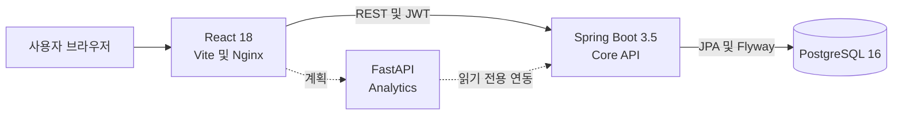

# ERP-Approid

중소 제조업의 영업, 생산, 구매, 재고 흐름을 하나의 데이터 모델로 연결하는 ERP 프로젝트입니다.
현재 저장소는 React 관리 화면, Spring Boot Core API, PostgreSQL 로컬 통합 환경을 제공합니다.

> 현재 개발 단계에서는 Spring Core API와 데이터베이스 업무 흐름이 구현되어 있으며,
> 프런트 업무 화면은 API 전환을 위한 공통 기반까지 완료된 상태입니다. 대부분의 업무 화면은
> 아직 `DataContext`의 메모리 데이터를 사용합니다.

## 빠른 시작

필요한 도구:

- Docker Desktop 또는 Docker Engine
- Docker Compose 플러그인
- Windows에서 검증 스크립트를 실행할 PowerShell 5.1 이상

저장소 루트에서 다음 명령을 실행합니다.

```powershell
Copy-Item .env.example .env
docker compose up --build --detach --wait
```

Linux 또는 macOS에서는 환경 파일을 다음과 같이 만듭니다.

```bash
cp .env.example .env
docker compose up --build --detach --wait
```

기동 후 접속 주소:

| 서비스 | 주소 |
| --- | --- |
| 프런트엔드 | http://127.0.0.1:3000 |
| Spring Core API | http://127.0.0.1:38080 |
| 상태 확인 | http://127.0.0.1:38080/actuator/health |
| Swagger UI | http://127.0.0.1:38080/swagger-ui.html |
| PostgreSQL | `127.0.0.1:15432` |

개발용 초기 계정은 `admin` / `admin123`입니다. 이 계정과 `.env.example`의 값은 로컬 개발
전용이며 운영 환경에서 사용하면 안 됩니다.

전체 환경을 검증하려면 다음 스크립트를 실행합니다.

```powershell
powershell.exe -NoProfile -ExecutionPolicy Bypass -File .\scripts\verify-local-compose.ps1
```

검증 스크립트는 컨테이너 health, Flyway V8, Actuator health, 관리자 로그인과 `/auth/me`,
관리자 metrics 접근, 프런트 HTTP 응답을 확인합니다.

## 현재 구현 상태

| 구분 | 상태 | 설명 |
| --- | --- | --- |
| PLT-01 빌드와 테스트 | 완료 | Spring 통합 테스트, OpenAPI 회귀 테스트, ESLint, Vitest 구성 |
| PLT-02 로컬 통합 환경 | 완료 | PostgreSQL, Spring, Nginx 프런트 Compose와 smoke 검증 |
| PLT-03 프런트 API 기반 | 완료 | 타입 생성, HTTP 클라이언트, React Query, 공통 비동기 상태 UI |
| PLT-04 인증과 권한 UI | 완료 | 로그인, 세션 복원·만료, 보호 라우트, 로그아웃, 역할별 UI 제어 |
| PLT-05 감사·추적·관측성 | 완료 | 동기 fail-closed 감사, actor/trace/snapshot, JSON 로그, health/metrics |
| MST-01 품목 화면 연동 | 예정 | 첫 번째 실제 API 기반 CRUD 화면으로 전환 |
| 분석 FastAPI | 미구현 | 분석 서비스 분리 여부를 결정한 뒤 ANL-04에서 구현 |

상세한 작업 순서와 완료 조건은 [서비스 구현 로드맵](docs/SERVICE_IMPLEMENTATION_ROADMAP.md)을
참조하세요.

## 주요 기능

Spring Core API에는 다음 업무 영역의 데이터 모델과 API가 구현되어 있습니다.

- 인증과 역할 기반 접근 제어
- 품목, 거래처, BOM, 공정 라우팅
- 견적, 수주, 출하, 미수금
- 생산계획과 작업오더
- 발주, 입고, 재고, Lot 추적
- 공통 오류 응답, 검증된 Trace ID, actor·before·after 감사 로그
- Logstash JSON 요청 로그, 공개 health, 관리자 전용 metrics

핵심 상태 전이는 서버 트랜잭션에서 처리합니다.

업무 쓰기와 감사 로그는 같은 트랜잭션에서 저장됩니다. 감사 actor, snapshot 직렬화 또는 감사 저장이
실패하면 업무 변경도 함께 롤백됩니다. 클라이언트가 보낸 `X-Trace-Id`는 안전한 문자 1~64자만
수용하며, 잘못된 값은 서버가 새 ID로 교체합니다. 이 값은 상관관계 조회용이며 인증·권한 판단에는
사용하지 않습니다.

1. 견적을 수주로 전환
2. 수주 확정과 작업오더 생성
3. 발주 입고와 Lot 및 재고 증가
4. 작업오더 완료와 완제품 입고
5. 출하 확정과 재고 감소 및 미수금 생성

프런트엔드는 각 업무 화면의 UI 프로토타입을 제공하며, 실제 API 연동은 로드맵 순서에 따라
화면별로 진행합니다.

## 아키텍처



로컬 Compose는 프런트엔드, Spring Core API, PostgreSQL만 실행합니다. FastAPI는 아직
서비스에 포함되지 않습니다.

## 기술 스택

| 영역 | 기술 |
| --- | --- |
| 프런트엔드 | React 18, TypeScript 5.6, Vite 6, React Router 6, Tailwind CSS 3 |
| 서버 상태 | TanStack React Query 5, Fetch 기반 공통 HTTP 클라이언트 |
| API 타입 | Spring OpenAPI 3.1, openapi-typescript |
| 디자인 | Pretendard Variable, Headless UI, Lucide, Chart.js, Recharts |
| 백엔드 | Java 21, Spring Boot 3.5, Spring Security, Spring Data JPA |
| 데이터베이스 | PostgreSQL 16, Flyway |
| 테스트 | JUnit 5, Testcontainers, Vitest, React Testing Library |
| 실행 환경 | Docker Compose, Nginx |

## 저장소 구조

```text
ERP-Approid/
├─ backend-spring/           Spring Core API와 Flyway 마이그레이션
├─ hud-admin-template/       React 관리 화면과 공통 API 기반
├─ docs/                     요구사항, API 명세, 인수인계, 구현 로드맵
├─ scripts/                  로컬 통합 검증 스크립트
├─ docker-compose.yml        로컬 통합 실행 정의
├─ .env.example              로컬 환경 변수 예제
└─ CLAUDE.md                 저장소 작업 규칙과 기술 기준
```

## 개발 명령

### 프런트엔드

```powershell
Set-Location hud-admin-template
npm ci
npm run dev
npm run test
npm run lint
npm run build
```

실행 중인 Spring 서버의 OpenAPI에서 TypeScript 타입을 다시 생성하려면 다음 명령을 사용합니다.

```powershell
npm run generate:api-types
```

생성 결과는 `hud-admin-template/src/api/generated/core.ts`에 저장됩니다.

### 백엔드

```powershell
Set-Location backend-spring
.\gradlew.bat test
.\gradlew.bat bootRun
```

백엔드를 직접 실행할 때는 PostgreSQL이 `localhost:15432`에서 실행 중이어야 합니다.

## 환경 변수

루트 `.env.example`을 `.env`로 복사해 사용합니다. `.env`는 Git에 포함되지 않습니다.

| 변수 | 기본 용도 |
| --- | --- |
| `DB_NAME`, `DB_USERNAME`, `DB_PASSWORD` | PostgreSQL 연결 |
| `DB_HOST_PORT` | 호스트 PostgreSQL 포트 |
| `BACKEND_HOST_PORT` | 호스트 Spring API 포트 |
| `FRONTEND_HOST_PORT` | 호스트 프런트 포트 |
| `JWT_SECRET` | 로컬 JWT 서명 키 |
| `INTERNAL_KEY` | 내부 API 인증 키 |
| `VITE_API_CORE_URL` | 브라우저에서 접근할 Core API URL |
| `VITE_API_ANALYTICS_URL` | 향후 Analytics API URL |

`VITE_*` 값은 브라우저 번들에 포함되므로 비밀번호, JWT secret, 내부 키를 넣지 마세요.
호스트 포트를 변경하는 방법은 [로컬 실행 가이드](docs/setup.md)에 정리되어 있습니다.

## 문서

- [기능 정의서](docs/desc.md)
- [API 명세서](docs/api-spec.md)
- [데이터베이스 스키마](docs/db-schema.md)
- [프로젝트 인수인계와 현재 상태](docs/PROJECT_HANDOVER.md)
- [서비스 구현 로드맵](docs/SERVICE_IMPLEMENTATION_ROADMAP.md)
- [로컬 통합 환경 실행](docs/setup.md)

## 운영 시 주의사항

현재 Compose와 예제 인증 정보는 로컬 개발 전용입니다. 운영 배포 전에는 최소한 다음 작업이
필요합니다.

- DB, JWT, 내부 API secret을 안전한 값으로 교체
- 허용 CORS origin 제한
- 운영 환경의 Swagger 노출 정책 분리
- HTTPS와 보안 헤더 적용
- 데이터베이스 백업과 복구 절차 수립
- 기본 관리자 계정 제거 또는 비밀번호 변경

운영 준비 항목은 로드맵의 PLT-05와 PLT-06에서 추적합니다.

## 서비스 종료

데이터를 유지하면서 서비스를 종료합니다.

```powershell
docker compose down
```

다음 명령은 PostgreSQL 볼륨과 로컬 데이터를 삭제하므로 초기화가 필요한 경우에만 실행하세요.

```powershell
docker compose down --volumes
```
