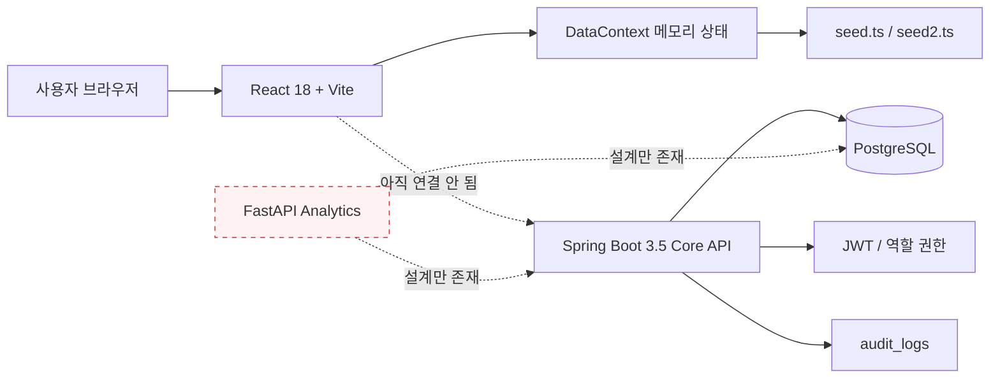

# ERP-Approid 프로젝트 인수인계 및 현재 상태

| 항목 | 내용 |
| --- | --- |
| 분석 기준일 | 2026-10-01 (Asia/Seoul) |
| 기준 브랜치 | `main` |
| 최근 커밋 | `ba122b9 feat(backend-spring): implement core ERP domain API (Spring Boot 3.5)` |
| 현재 판단 | UI 프로토타입과 Phase 1 백엔드가 각각 존재하지만 아직 연결되지 않은 MVP 개발 단계 |

## 1. 한눈에 보는 결론

ERP-Approid는 중소 제조업의 견적·수주·생산·구매·재고·출하 흐름을 다루는 웹 ERP다.
저장소는 React/Vite 프런트엔드와 Spring Boot 백엔드를 함께 보관하지만, 실제 런타임은 아직
하나의 시스템으로 연결되어 있지 않다.

| 영역 | 상태 | 판단 근거 |
| --- | --- | --- |
| 프런트 UI | 주의 | 화면과 라우팅은 풍부하나 데이터는 대부분 시드/하드코딩이며 새로고침 시 초기화됨 |
| 프런트 빌드 | 정상 | `npm run build` 성공 |
| 프런트 품질 게이트 | 차단 | 테스트 스크립트가 없고 `npm run lint`는 ESLint 설정 부재로 실패 |
| Spring 도메인 API | 구현·검증됨 | 16개 컨트롤러, 78개 핸들러, 5대 업무 흐름, 통합 테스트 15개 통과 |
| DB | 설계·마이그레이션 있음 | PostgreSQL용 Flyway V1~V8, 18개 JPA 엔티티와 시드가 존재 |
| 인증/권한 | 백엔드만 구현 | JWT와 역할 권한은 있으나 프런트 로그인/라우트 보호는 동작하지 않음 |
| 분석 서비스 | 미구현 | 설계 문서의 `backend-fastapi`와 `/api/analytics`가 저장소에 없음 |
| 통합 실행 환경 | 미구현 | 설계 문서의 루트 `docker-compose.yml`, 백엔드 Dockerfile, `docs/setup.md`가 없음 |
| 배포 | 프런트 전용 | Nginx + Cloudflare Tunnel 구성이 정적 프런트만 배포함 |

가장 중요한 사실은 다음 두 가지다.

1. 프런트와 백엔드는 동일한 업무 흐름을 **각자 따로** 구현하고 있다. 프런트는
   `DataContext`에서 메모리 상태를 바꾸고, 백엔드는 PostgreSQL 트랜잭션을 수행한다.
2. 최초 분석에서 확인한 `springdoc-openapi 2.8.17` 경로 패턴 회귀는 2.8.14 핀과
   OpenAPI 회귀 테스트 추가로 해결되었고, 현재 백엔드 테스트 15개가 통과한다.

## 2. 현재 아키텍처



목표 설계는 프런트가 `/api/core/*`의 Spring API와 `/api/analytics/*`의 FastAPI를 호출하는
구조다. 현재는 Spring만 구현되어 있고 프런트의 `src/api/` 및 환경 변수 파일도 없다.

## 3. 저장소 지도

```text
ERP-Approid/
├── backend-spring/                 Spring Boot Core API
│   ├── src/main/java/.../api/      REST 컨트롤러와 DTO
│   ├── src/main/java/.../domain/   JPA 엔티티와 Repository
│   ├── src/main/java/.../security/ JWT, Security 필터
│   ├── src/main/java/.../common/   예외, 감사 기반, 번호 생성, Trace ID
│   ├── src/main/resources/db/      Flyway V1~V8
│   └── src/test/                   단위·계약·Testcontainers 통합 테스트
├── hud-admin-template/             React 관리자 웹
│   ├── src/pages/                  ERP 화면 + 원본 템플릿 화면
│   ├── src/store/                  DataContext, 타입, 시드 데이터
│   ├── src/components/             테이블, 모달, 카드, 레이아웃
│   └── infra/                      프런트 전용 Nginx/Cloudflare 배포
└── docs/                           기능 정의, API, DB, 백엔드 설계
```

루트 README, CI 워크플로, 루트 빌드 명령은 없다. 두 애플리케이션은 각 디렉터리에서 별도로
실행해야 한다.

## 4. 기술 스택

| 계층 | 기술 | 확인된 버전/설정 |
| --- | --- | --- |
| 프런트 언어 | TypeScript | lock 기준 5.6.3 |
| 프런트 프레임워크 | React | 18.3.1 |
| 라우팅/빌드 | React Router / Vite | 6.22 계열 / lock 기준 6.4.1 |
| UI | Tailwind CSS, Headless UI, Lucide | Tailwind 3.4.19 |
| 백엔드 언어 | Java | Toolchain 21 |
| 백엔드 프레임워크 | Spring Boot | 3.5.0, Spring Framework 6.2.7 |
| 데이터 | Spring Data JPA, PostgreSQL | 로컬 기본 포트 15432 |
| 마이그레이션 | Flyway | V1~V8 |
| 보안 | Spring Security, JJWT | JWT HS256, 기본 만료 60분 |
| API 문서 | springdoc-openapi | 2.8.14 고정, OpenAPI/Swagger UI 회귀 테스트 포함 |
| 백엔드 테스트 | JUnit 5, Testcontainers | PostgreSQL 컨테이너 사용 |
| 배포 | Nginx 1.27 Alpine, Cloudflare Tunnel | 현재 프런트 정적 파일만 대상 |

현재 개발 머신에서 확인한 런타임은 Java 21.0.12.1, Node 24.19.0, npm 11.17.0이다.
Node 엔진 범위는 `package.json`에 고정되어 있지 않다.

## 5. 프런트엔드 상세

### 5.1 진입점과 라우팅

- `src/main.tsx`: `ThemeProvider`와 `DataProvider`를 장착한다.
- `src/App.tsx`: `BrowserRouter`와 33개의 `Route` 요소를 선언한다.
- `src/layouts/MainLayout.tsx`: 인증 검사 없이 사이드바/헤더/본문을 표시한다.
- `src/components/layout/Sidebar.tsx`: ERP 모듈별 메뉴를 구성한다.

`src/pages/`에는 60개의 TSX 파일이 있다. 이 중 DataContext를 사용하는 페이지는 10개다.

- 품목, BOM
- 수주, 견적, 출하
- 작업오더
- MRP, 발주, 입고
- 재고 현황

대시보드, 분석, 생산계획, Lot, 품질, 설비, 외주, 인사, 회계, 게시판 등은 화면 내부의
상수 배열이나 고정 KPI를 표시한다. 버튼 중 상당수도 시각 요소만 있고 영속 작업은 하지 않는다.

### 5.2 현재 데이터 흐름

```text
페이지 이벤트
  -> useData()/useCollection()
  -> DataContext의 create/update/remove 또는 5개 업무 액션
  -> React useState 갱신
  -> 같은 탭에서만 화면 반영
```

`fetch`, Axios, API 클라이언트, 로딩/재시도/서버 오류 상태가 없다. 메모리 상태이므로 새로고침하면
모든 변경이 `seed.ts`, `seed2.ts`의 초기 데이터로 돌아간다.

### 5.3 인증 상태

`/login`은 이메일과 비밀번호를 입력할 수 있지만 submit 핸들러가 `preventDefault()`만 수행한다.
JWT 저장, `/auth/login` 호출, 사용자 컨텍스트, 로그아웃, 보호 라우트가 없다. 따라서 `/` 이하의
업무 화면에 로그인 없이 직접 접근할 수 있다.

### 5.4 프런트 품질 상태

| 명령 | 2026-10-01 결과 | 비고 |
| --- | --- | --- |
| `npm run build` | 성공 | 1,517 모듈, JS 357.29 kB (gzip 94.87 kB) |
| `npm run lint` | 실패 | ESLint 9용 `eslint.config.js`가 없음 |
| 프런트 테스트 | 없음 | test 스크립트와 테스트 의존성이 없음 |

## 6. Spring 백엔드 상세

### 6.1 구현 범위

현재 소스 규모는 메인 Java 82개/약 5,204줄, 테스트 Java 2개/약 309줄이다.

| 지표 | 수량 |
| --- | ---: |
| REST 컨트롤러 | 16 |
| HTTP 핸들러 | 78 (`GET` 30, `POST` 28, `PATCH` 10, `DELETE` 10) |
| JPA 엔티티 | 18 |
| Repository | 17 |
| Flyway 마이그레이션 | 7 |
| 통합 테스트 클래스 | 1 (테스트 메서드 13개) |

구현된 도메인은 인증, 품목, 거래처, BOM, 공정, 견적, 수주, 출하, 미수금, 생산계획,
작업오더, 발주, 입고, 재고, Lot, 내부 조회 API다. 품질·설비·외주·인사·회계·게시판 API와
FastAPI 분석 서비스는 없다. 이는 백엔드 설계 문서에서 Phase 2 이후로 둔 범위와 대체로 일치한다.

### 6.2 요청 생명주기 예시: 수주 확정

```text
POST /api/core/sales-orders/{id}/confirm
  -> TraceIdFilter: X-Trace-Id 생성/전파
  -> JwtAuthenticationFilter: JWT 파싱 및 인증 객체 설정
  -> @PreAuthorize: SALES 또는 ADMIN 확인
  -> SalesOrderController.confirm(): 상태/품목 유형 검증
  -> SalesOrder 상태를 확정으로 변경
  -> WorkOrder 생성
  -> 같은 @Transactional 경계에서 저장
  -> 같은 트랜잭션에서 AuditService 감사 기록(실패 시 전체 롤백)
  -> 수주 DTO + 작업오더 번호 응답
```

현재 비즈니스 로직은 별도 서비스 계층이 아니라 컨트롤러에 직접 들어 있다. 설계 문서가 제안한
`service/` 및 MapStruct 매퍼 계층은 구현되지 않았고, MapStruct 의존성도 실제 코드에서 쓰이지 않는다.
MVP 규모에서는 빠르지만 컨트롤러 테스트·재사용·트랜잭션 경계 관리가 어려워질 수 있다.

### 6.3 핵심 업무 흐름

| 업무 흐름 | 프런트 메모리 액션 | Spring 엔드포인트 | 백엔드 코드 |
| --- | --- | --- | --- |
| 견적 → 수주 | `quotationToOrder()` | `POST /sales-orders/from-quotation/{id}` | 구현 |
| 수주 확정 → 작업오더 | `confirmSalesOrder()` | `POST /sales-orders/{id}/confirm` | 구현 |
| 발주 → 입고/Lot/재고 | `receivePurchaseOrder()` | `POST /receivings` | 구현 |
| 작업오더 완료 → Lot/재고 | `completeWorkOrder()` | `POST /work-orders/{id}/complete` | 구현 |
| 출하 확정 → 미수/재고 | `confirmShipment()` | `POST /shipments/{id}/confirm` | 구현 |

동일한 규칙이 프런트와 백엔드에 중복되어 있으므로 API 연결 후 프런트 업무 액션은 서버 호출로
교체하고, 상태 전이의 단일 진실 공급원은 백엔드로 정해야 한다.

### 6.4 DB와 마이그레이션

- V1: 사용자, 역할, 감사 로그
- V2: 품목, 거래처, BOM, 공정
- V3: 견적, 수주, 출하, 미수금
- V4: 생산계획, 작업오더
- V5: 발주, 입고, Lot, 재고 트랜잭션
- V6: 역할과 개발용 `admin` 사용자 시드
- V7: 프런트 시드와 맞춘 도메인 데이터

JPA는 `ddl-auto: validate`, Flyway가 스키마 소스다. 금액은 원화 정수, 수량은 소수형이며
엔티티에는 낙관적 잠금 버전이 있다. 로컬 기본 접속 정보는 `localhost:15432`, DB
`erp_approid`, 사용자 `erp`다. 기본 관리자 비밀번호는 마이그레이션 주석에 있는 개발용 값이며
운영 배포 전에 반드시 교체해야 한다.

### 6.5 현재 백엔드 검증 결과

최초 `./gradlew test`는 springdoc 2.8.17에서 Spring 컨텍스트 초기화 중 실패했다.

```text
Invalid mapping pattern detected:
/swagger-ui/**/*swagger-initializer.js
No more pattern data allowed after ** pattern element
```

스택 트레이스는 `springdoc-openapi 2.8.17`의 `AbstractSwaggerConfigurer`를 가리켰다.
Spring Boot 3.5 호환 계열 안에서 2.8.14로 고정하고 `/v3/api-docs`와 `/swagger-ui.html`을
검증하는 `OpenApiIntegrationTest` 2개를 추가했다.

- RED: 2.8.17에서 새 테스트 2개 모두 동일한 `PatternParseException`으로 실패
- GREEN: 2.8.14에서 OpenAPI 테스트 2개 통과
- 전체 검증: 기존 업무 흐름 13개 + OpenAPI 2개, 총 15개 통과
- Docker 및 PostgreSQL Testcontainer 연결 성공

## 7. 설계 문서와 구현의 차이

| 설계/문서에 있는 항목 | 실제 상태 |
| --- | --- |
| `backend-fastapi/` 분석 서비스 | 없음 |
| `/api/analytics/*` 8개 분석 API | 없음 |
| 루트 `docker-compose.yml`로 전체 구동 | 없음 |
| `openapi/` 생성 명세 스냅샷 | 없음 |
| `docs/setup.md` | 없음 |
| 프런트 `src/api/`, 생성 타입, JWT 인터셉터 | 없음 |
| `VITE_API_CORE_URL`, `VITE_API_ANALYTICS_URL` 예시 | 없음 |
| Spring `service/`, 별도 DTO/Mapper 계층 | DTO는 있으나 컨트롤러가 Repository와 업무 로직을 직접 담당 |
| 프런트 API 연동 완료 조건 | 미완료 |
| 전체 E2E | 미구현 |

`docs/desc.md`, `docs/db-schema.md`, `docs/api-spec.md`는 요구사항과 목표 설계를 이해하는 데 유용하지만,
실제 배포 가능 상태를 나타내는 문서로 읽으면 안 된다. 특히 `docs/api-spec.md`의 FastAPI 부분과
프런트 연동 절은 미래 목표다.

## 8. 보안·정합성·운영 위험

### P0 — 바로 해결해야 하는 차단 항목

1. **프런트-백엔드 단절**: 사용자가 보는 데이터와 DB 데이터가 완전히 별개다.
2. **운영 토폴로지 결정 필요**: 로컬 Compose는 재현 가능하지만 실제 운영 프록시·비밀 저장소·중앙 로그 저장소는 아직 선정하지 않았다.

### P1 — 첫 통합 전에 고쳐야 할 위험

1. **인증 UI 미구현**: 로그인 화면이 장식이고 보호 라우트가 없다.
2. **감사 정책 적용 완료**: PLT-05에서 비동기 self-invocation을 제거하고 동기 fail-closed 정책,
   `AuditorAware`, trace 검증, before/after snapshot, JSON 로그와 health/metrics를 적용했다.
3. **감사 운영 정책 후속 필요**: 장기 보존·파티셔닝·관리자 조회와 외부 로그 수집은 운영 단계에서 확정한다.
4. **번호 생성의 다중 인스턴스 경쟁**: `DomainNumberGenerator`는 프로세스 메모리 카운터다.
   DB 유니크 제약은 중복을 막지만 코드 주석과 달리 충돌 재시도 로직은 보이지 않는다.
5. **운영 보안 기준선 완료**: PLT-06에서 활성 프로필과 개발 secret의 암묵적 공통 기본값을 제거하고,
   운영 secret 강도·예제값·동일값을 검증한다.
6. **CORS 경계 적용**: exact-origin, 명시적 요청 헤더, credentials 비활성 정책으로 변경했다.
7. **Swagger와 입력 경계 적용**: 운영 Swagger를 끄고 보안 헤더와 JSON 포함 1MiB 요청 제한을 적용했다.
8. **운영 인프라 후속 필요**: 외부 백업 저장소·중앙 로그 수집·관리자 계정 발급 시스템은 배포 환경에서 연결해야 한다.

### P2 — 품질과 유지보수 부채

1. ESLint 설정과 프런트 테스트가 없다.
2. CI가 없어 빌드·테스트·마이그레이션 회귀를 자동으로 막지 못한다.
3. 컨트롤러가 업무 로직과 매핑을 모두 담당해 파일이 커지고 계층 경계가 흐리다.
4. 대시보드 등 다수 화면이 독립 하드코딩 데이터를 사용해 서로 다른 숫자를 보여줄 수 있다.
5. API 문서가 수기 Markdown뿐이며 실제 `/v3/api-docs` 스냅샷이나 계약 검증이 없다.
6. Node 버전 정책, 코드 포맷터, 프런트 파일 명명 규칙이 명시되지 않았다.

## 9. 로컬 실행 방법과 전제조건

### 프런트

```powershell
cd hud-admin-template
npm ci
npm run dev       # Vite 포트 3000
npm run build
```

현재 `npm run lint`는 설정 파일을 추가하기 전까지 실패한다.

### 백엔드

필수 조건은 Java 21과 PostgreSQL이다. 애플리케이션 기본 DB 포트는 표준 5432가 아니라 15432다.
저장소가 DB 컨테이너를 제공하지 않으므로 직접 PostgreSQL을 준비해야 한다.

```powershell
cd backend-spring
.\gradlew.bat bootRun
.\gradlew.bat test    # Docker 필요: Testcontainers가 PostgreSQL을 기동
```

주요 환경 변수:

| 변수 | 용도 |
| --- | --- |
| `DB_HOST`, `DB_PORT`, `DB_NAME` | PostgreSQL 위치와 DB |
| `DB_USERNAME`, `DB_PASSWORD` | DB 인증 |
| `JWT_SECRET` | HS256 서명 키 |
| `INTERNAL_KEY` | 향후 FastAPI → Spring 내부 호출 키 |
| `SPRING_PROFILES_ACTIVE` | `local`, `test`, `prod` 중 명시(기본값 없음) |
| `CORS_ALLOWED_ORIGIN(S)` | local 단일 origin 또는 prod exact-origin 목록 |

정상 기동 후 목표 주소는 API `http://localhost:38080/api/core`, Swagger
`http://localhost:38080/swagger-ui.html`이다. springdoc 충돌은 2.8.14 핀과 회귀 테스트로 해결되었다.

## 10. 배포 상태

`hud-admin-template/infra/compose.zorin.yml`은 빌드된 `dist/`를 Nginx로 제공하고 선택적으로
Cloudflare Tunnel을 붙인다. 호스트에는 `127.0.0.1:9080`으로만 바인딩하며 SPA fallback과
기본 보안 헤더를 설정한다.

이 구성에는 PostgreSQL, Spring, FastAPI가 없다. 현재 배포 스크립트를 실행하면 UI 데모는
배포할 수 있지만 실데이터 ERP는 배포되지 않는다. 루트에는 전체 로컬 Compose와 백업·복구·마이그레이션
절차가 마련됐지만, 백엔드 API 프록시와 운영 비밀 저장소를 포함한 실제 운영 토폴로지는 별도 확정이 필요하다.

## 11. 권장 작업 순서

1. **백엔드 기준선 복구**: springdoc/Spring Boot 호환 조합을 확정하고 13개 통합 테스트를 모두 통과시킨다.
2. **재현 가능한 개발 환경**: 루트 Compose에 PostgreSQL과 Spring을 추가하고 `.env.example`과
   `docs/setup.md`를 만든다. FastAPI는 구현 결정을 내릴 때까지 선택 프로필로 둘 수 있다.
3. **한 개 수직 흐름 연결**: 로그인 → JWT → 품목 목록/CRUD를 먼저 연결한다. 공통 API 클라이언트,
   오류 정규화, 로딩 상태, 401 처리 패턴을 여기서 확정한다.
4. **5대 흐름 서버화**: DataContext의 다섯 업무 액션을 순서대로 API 호출로 교체하고 중복 규칙을 제거한다.
5. **운영 인프라 연결**: PLT-06 보안 기준선과 복구 절차는 완료했다. 실제 비밀 저장소, 원격 백업,
   중앙 로그 수집기와 관리자 고유 계정 발급 절차를 배포 환경에 연결한다.
6. **품질 게이트 추가**: ESLint flat config, 프런트 단위 테스트, 백엔드 테스트, 두 빌드를 CI 필수 항목으로 둔다.
7. **분석 서비스 범위 재확정**: 당장 필요한 KPI는 Spring SQL 집계로 시작할지, 설계대로 FastAPI를
   도입할지 결정한 뒤 구현한다.

첫 인수 주간의 현실적인 완료 기준은 “루트 명령 하나로 DB와 Spring을 띄우고, 프런트에서 실제
admin 로그인을 거쳐 품목 목록을 조회·수정하며, CI가 이를 검증하는 상태”다.

## 12. 코드 규칙과 Git 관례

- 프런트 컴포넌트/페이지 파일은 PascalCase, 훅/유틸은 camelCase를 사용한다.
- 백엔드는 `com.erpapproid.core` 아래 기능별 API 패키지와 도메인별 패키지를 사용한다.
- URL은 복수형 kebab-case, 상태 전이는 행위 기반 POST를 사용한다.
- 요청 검증은 Jakarta Validation, 도메인 오류는 `DomainException`과 공통 `ErrorResponse`를 사용한다.
- 쓰기 작업은 `AuditService`에 기록하는 패턴을 따른다.
- 최근 5개 커밋은 `feat(scope): ...`, `chore: ...` 형태의 Conventional Commits 스타일이다.
- Git 이력이 5개뿐이라 브랜치/PR 병합 정책은 판단할 수 없다.

## 13. 어디를 먼저 볼 것인가

| 목적 | 시작 파일 |
| --- | --- |
| 제품 범위 이해 | `docs/desc.md` |
| 목표 아키텍처 이해 | `docs/superpowers/specs/2026-09-20-erp-approid-backend-design.md` |
| API 계약 이해 | `docs/api-spec.md` |
| 테이블/관계 이해 | `docs/db-schema.md`, `backend-spring/src/main/resources/db/migration/` |
| 프런트 라우팅 | `hud-admin-template/src/App.tsx` |
| 프런트 임시 상태/업무 흐름 | `hud-admin-template/src/store/DataContext.tsx` |
| 백엔드 시작점 | `backend-spring/src/main/java/com/erpapproid/core/CoreApplication.java` |
| 인증/권한 | `backend-spring/src/main/java/com/erpapproid/core/security/` |
| 대표 업무 흐름 | `backend-spring/src/main/java/com/erpapproid/core/api/sales/SalesOrderController.java` |
| 회귀 시나리오 | `backend-spring/src/test/java/com/erpapproid/core/flow/FlowIntegrationTest.java` |
| 프런트 배포 | `hud-admin-template/DEPLOYMENT.md`, `hud-admin-template/infra/` |

## 14. 확인이 필요한 의사결정

- FastAPI 분석 서비스를 계속 별도 서비스로 만들 것인가, 초기에는 Spring에 합칠 것인가?
- Zorin OS/Cloudflare 배포 경로가 실제 운영 표준인가, 단순 데모 배포인가?
- 프런트에 보이는 Phase 2~4 화면을 유지할지, 실제 구현 전에는 메뉴에서 숨길지?
- 감사 로그는 Phase 1에서 업무와 같은 트랜잭션으로 실패시키며, 비동기 전환 시 outbox 요구를 재검토한다.
- 단일 공장/단일 인스턴스 가정이 언제까지 유효한가?
- 운영 DB와 비밀, 백업, 관측성의 책임 주체는 누구인가?

## 15. 분석 시점 Git 상태

분석 시작 전에는 springdoc 2.8.17 미커밋 변경이 있었다. 이후 PLT-01 첫 작업으로 회귀를
재현한 뒤 2.8.14로 고정하고 테스트를 추가했다.

```text
M backend-spring/build.gradle.kts
  springdoc-openapi-starter-webmvc-ui: 2.6.0 -> 2.8.14
?? backend-spring/src/test/java/com/erpapproid/core/support/OpenApiIntegrationTest.java
```

이 문서와 루트 `CLAUDE.md`가 이번 분석으로 새로 추가되었다.
